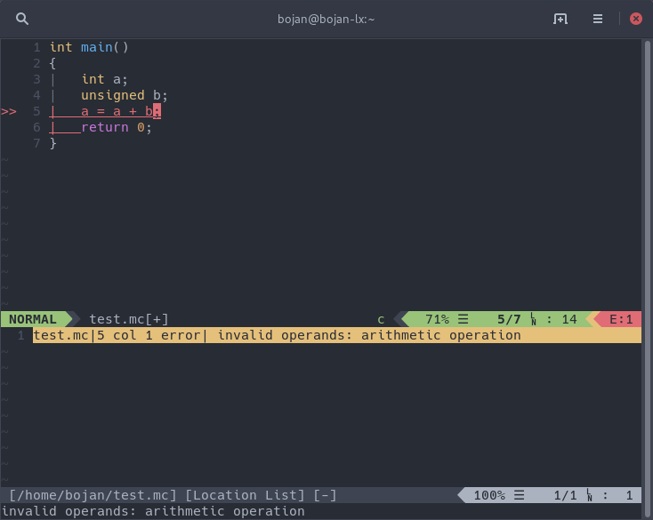

# minic-lsp-ale

Provides miniC language support for [Vim](https://www.vim.org/) using
[ALE](https://github.com/w0rp/ale) and [minic-lsp language server](https://github.com/BojanStipic/minic-lsp).



## minic-lsp

minic-lsp is a [Language Server](https://langserver.org/) implementation for the miniC programming language.
It is available under the GNU GPLv3 or later license, and can be found
[here](https://github.com/BojanStipic/minic-lsp).

## Prerequisites

* [Vim](https://www.vim.org/) 8.0 or later
* [ALE](https://github.com/w0rp/ale)
* [minic-lsp](https://github.com/BojanStipic/minic-lsp) executable installed in your `$PATH`

## Installation

Use your preferred Vim plugin manager to install this plugin.

If you don't have a preferred plugin manager, you can use
[Vim-Plug](https://github.com/junegunn/vim-plug):

1. Add the GitHub path for this repository to your `~/.vimrc`.
```
Plug 'BojanStipic/minic-lsp'
```
2. Open Vim and run `:PlugInstall`.
